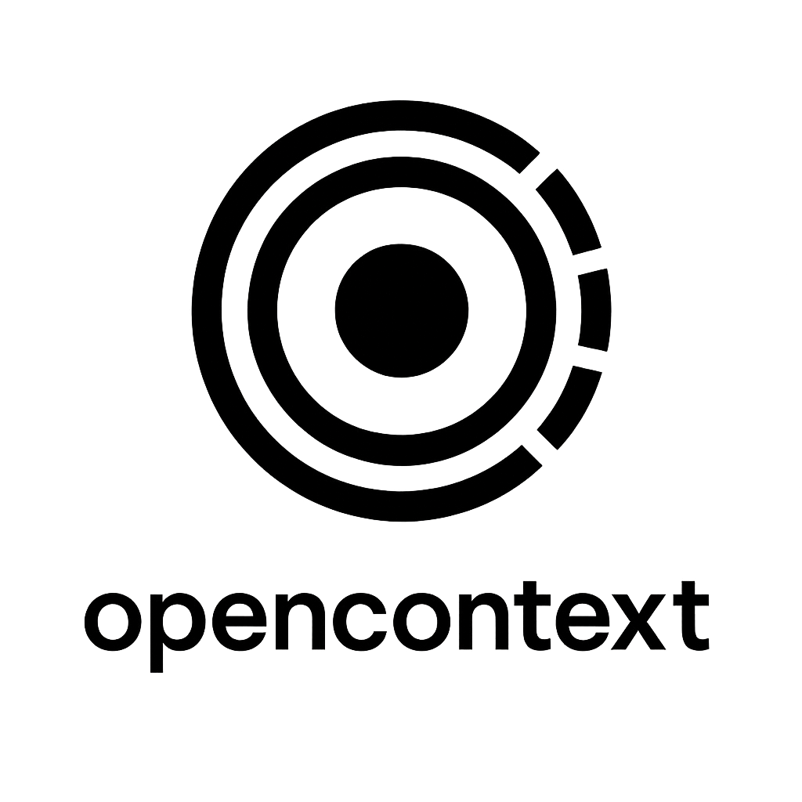

# OpenContext

<div align="center">
  
  
  **Advanced Long-Context Language Model Framework**
  
  [](https://www.python.org/downloads/)
  [](https://pytorch.org/)
  [](https://opensource.org/licenses/MIT)
  [](https://github.com/nikjois/OpenContext)
  [](https://github.com/nikjois/OpenContext)
</div>

## Overview

OpenContext is a comprehensive framework for developing, training, and evaluating long-context language models. It provides state-of-the-art implementations of efficient attention mechanisms, robust backend support for CUDA, CPU, and Apple Silicon (MLX), and extensive tools for research and production deployment.

### Key Features

- **Multi-Backend Support**: Seamless operation across CUDA GPUs, CPU, and Apple Silicon with MLX
- **Advanced Attention Mechanisms**: Flash Attention, Longformer, BigBird, Hyena, and more
- **Synthetic Dataset Generation**: Copy tasks, recall tasks, and reasoning benchmarks
- **Comprehensive Evaluation**: Built-in metrics and analysis tools
- **Production Ready**: FastAPI-based inference server with authentication
- **Research Tools**: Experiment tracking, hyperparameter optimization, and reproducibility

## Installation

### Quick Start

```bash
pip install openlongcontext
```

### Development Installation

```bash
git clone https://github.com/nikjois/OpenContext.git
cd OpenContext
pip install -e .
```

### Backend-Specific Installation

#### CUDA Support (GPU)
```bash
pip install -r requirements-cuda.txt
```

#### Apple Silicon (MLX)
```bash
pip install -r requirements-mlx.txt
```

## Quick Start

### Command Line Interface

OpenContext provides a comprehensive CLI for common tasks:

```bash
# Run inference with mock data
python -m openlongcontext.cli.main inference --use-mock --model longformer

# Evaluate on copy task
python -m openlongcontext.cli.main evaluate --task copy --num-samples 100

# Train a model
python -m openlongcontext.cli.main train --model flashattention --epochs 10

# Check system information
python -m openlongcontext.cli.main info
```

### Python API

```python
from openlongcontext.models.longformer import LongformerForQuestionAnswering
from openlongcontext.core.backend import set_backend

# Set backend (auto-detects best available)
set_backend("cuda")  # or "cpu", "mlx"

# Initialize model
model = LongformerForQuestionAnswering(max_length=4096)

# Run inference
context = "Your long context here..."
question = "What is the main topic?"
answer, confidence = model.get_answer_with_confidence(context, question)

print(f"Answer: {answer} (confidence: {confidence:.3f})")
```

### Synthetic Data Generation

```python
from openlongcontext.datasets.synthetic.copy_task import CopyTask
from openlongcontext.evaluation.copy_metrics import CopyMetrics

# Generate copy task dataset
dataset = CopyTask(seq_length=2048, num_samples=1000)

# Evaluate model performance
metrics = CopyMetrics()
for sample in dataset:
    # Your model prediction logic here
    prediction = model.predict(sample['input_sequence'])
    metrics.update(prediction, sample['target_sequence'])

results = metrics.compute()
print(f"Copy accuracy: {results['copy_accuracy']:.3f}")
```

## Supported Models

### Attention Mechanisms

| Model | Description | Context Length | Backend Support |
|-------|-------------|----------------|-----------------|
| **Flash Attention** | Memory-efficient attention with linear scaling | 32K+ | CUDA, CPU, MLX |
| **Longformer** | Sparse attention with sliding window | 16K | CUDA, CPU, MLX |
| **BigBird** | Block-sparse attention mechanism | 16K | CUDA, CPU, MLX |
| **Hyena** | Subquadratic attention alternative | 32K+ | CUDA, CPU, MLX |
| **Linear Attention** | Linear complexity attention | 64K+ | CUDA, CPU, MLX |

### Model Architectures

- **Transformer-XL**: Recurrent memory for long sequences
- **Memorizing Transformer**: External memory augmentation  
- **RWKV**: Receptance Weighted Key Value architecture
- **Rotary Position Embedding**: Enhanced positional encoding

## Backend Support

OpenContext automatically detects and optimizes for your hardware:

### CUDA (NVIDIA GPUs)
- Flash Attention acceleration
- Triton kernel optimization
- Multi-GPU support
- Mixed precision training

### CPU
- Optimized PyTorch operations
- Multi-threading support  
- Memory-efficient implementations
- Cross-platform compatibility

### Apple Silicon (MLX)
- Native Apple Silicon optimization
- Unified memory architecture
- Metal Performance Shaders
- Energy-efficient inference

## Evaluation and Benchmarks

### Synthetic Tasks

OpenContext includes comprehensive synthetic benchmarks:

- **Copy Task**: Tests exact sequence copying ability
- **Recall Task**: Evaluates information retrieval from context
- **Reasoning Task**: Assesses logical reasoning over long contexts

### Real-World Datasets

Integrated support for:
- **PG-19**: Long-form text generation
- **Books3**: Literary text understanding  
- **ArXiv Papers**: Scientific document processing
- **Code Repositories**: Programming context understanding

### Metrics

- Token-level accuracy
- Exact match scoring
- Edit distance computation
- Perplexity evaluation
- Custom metric support

## API Server

Deploy OpenContext models with the built-in FastAPI server:

```bash
# Start inference server
python -m openlongcontext.api

# With authentication
python -m openlongcontext.api --auth
```

### API Endpoints

```python
import requests

# Question answering
response = requests.post("http://localhost:8000/qa", json={
    "context": "Your context here...",
    "question": "Your question?",
    "model": "longformer"
})

# Text generation  
response = requests.post("http://localhost:8000/generate", json={
    "prompt": "Generate text from this prompt...",
    "max_length": 2048
})
```

## Research and Experiments

### Experiment Tracking

```python
from openlongcontext.tracking.logger import configure_experiment_logging
from openlongcontext.core.experiment import Experiment

# Setup experiment
logger = configure_experiment_logging("my_experiment")
experiment = Experiment("long_context_study", logger=logger)

# Track hyperparameters
experiment.log_hyperparameters({
    "model": "longformer",
    "seq_length": 4096,
    "batch_size": 8
})

# Run and log results
results = experiment.run()
experiment.log_metrics(results)
```

### Hyperparameter Optimization

```python
from openlongcontext.ablation.bayesian_optimization import BayesianOptimizer

# Define search space
search_space = {
    "learning_rate": (1e-5, 1e-3),
    "batch_size": [4, 8, 16, 32],
    "seq_length": [1024, 2048, 4096]
}

# Optimize
optimizer = BayesianOptimizer(search_space)
best_params = optimizer.optimize(objective_function, n_trials=50)
```

## Configuration

OpenContext uses Hydra for configuration management:

```yaml
# config.yaml
model:
  name: longformer
  max_length: 4096
  attention_window: 512

training:
  batch_size: 8
  learning_rate: 1e-4
  epochs: 10

backend:
  device: auto  # cuda, cpu, mlx, or auto
  mixed_precision: true
```

## Contributing

We welcome contributions! Please see [CONTRIBUTING.md](CONTRIBUTING.md) for guidelines.

### Development Setup

```bash
git clone https://github.com/nikjois/OpenContext.git
cd OpenContext
pip install -e ".[dev]"
pre-commit install
```

### Running Tests

```bash
# Run all tests
pytest

# With coverage
pytest --cov=openlongcontext --cov-report=html

# Run specific test suite
pytest tests/unit/test_models.py
```

## Documentation

Comprehensive documentation is available at [https://nikjois.github.io/OpenContext](https://nikjois.github.io/OpenContext)

- [Architecture Overview](docs/architecture.md)
- [Model Implementations](docs/models.md)
- [Backend Configuration](docs/backends.md)
- [API Reference](docs/api.md)
- [Evaluation Guide](docs/evaluation.md)
- [Deployment Guide](docs/deployment.md)

## Performance Benchmarks

### Context Length Scaling

| Model | 1K | 4K | 16K | 32K | Memory (GB) |
|-------|----|----|-----|-----|-------------|
| Flash Attention | 150ms | 180ms | 280ms | 450ms | 2.1 |
| Longformer | 120ms | 160ms | 320ms | 680ms | 3.2 |
| Standard Attention | 100ms | 400ms | 6.4s | OOM | N/A |

*Benchmarks on NVIDIA A100 40GB with batch size 1*

### Backend Comparison

| Backend | Throughput (tokens/s) | Memory Efficiency | Energy Usage |
|---------|----------------------|-------------------|--------------|
| CUDA | 1,200 | High | High |
| CPU | 180 | Medium | Medium |
| MLX (Apple Silicon) | 350 | Very High | Very Low |

## Citation

If you use OpenContext in your research, please cite:

```bibtex
@software{openlongcontext2024,
  title={OpenContext: Advanced Long-Context Language Model Framework},
  author={Jois, Nik},
  year={2024},
  url={https://github.com/nikjois/OpenContext},
  email={nikjois@llamasearch.ai}
}
```

## License

This project is licensed under the MIT License - see the [LICENSE](LICENSE) file for details.

## Acknowledgments

OpenContext builds upon research and implementations from:

- **Flash Attention**: Dao et al., "FlashAttention: Fast and Memory-Efficient Exact Attention with IO-Awareness" (2022)
- **Longformer**: Beltagy et al., "Longformer: The Long-Document Transformer" (2020)
- **BigBird**: Zaheer et al., "Big Bird: Transformers for Longer Sequences" (2020)
- **Hyena**: Poli et al., "Hyena Hierarchy: Towards Larger Convolutional Language Models" (2023)
- **MLX**: Apple Machine Learning Research Team

## Support

- **Issues**: [GitHub Issues](https://github.com/nikjois/OpenContext/issues)
- **Email**: nikjois@llamasearch.ai
- **Documentation**: [https://nikjois.github.io/OpenContext](https://nikjois.github.io/OpenContext)

---

<div align="center">
  <p>Built with ❤️ by <a href="mailto:nikjois@llamasearch.ai">Nik Jois</a></p>
  <p>© 2024 OpenContext. All rights reserved.</p>
</div>